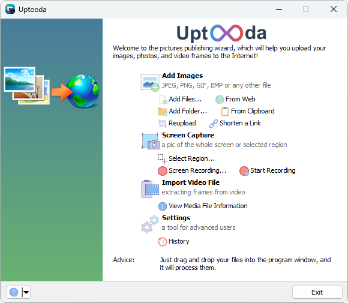
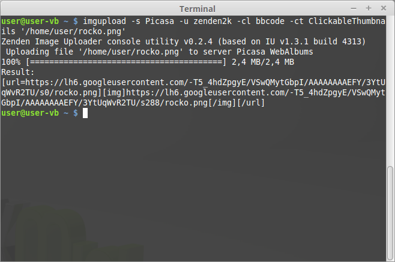

 

# Uptooda

Uptooda (formerly Image Uploader) is a free program for Windows for uploading images, screenshots and other file formats to over 30 different file hosting services. 
Official website: https://uptooda.com

Supported operating systems: Windows 7/8/8.1/10/11 or newer

Image Uploader [version 1.3.2](https://github.com/zenden2k/image-uploader/releases/tag/1.3.2-release) was the last supported release for Windows XP and Windows Vista.

## Main Features

### Screen capturing and annotating
Uptooda can make screenshots of entire screen or selected screen region.

### Uploading files to image hostings and file hostings
It can upload to more than [20 image hostings sites](https://svistunov.dev/imageuploader_servers). After uploading, Uptooda generates HTML code, BBCode for forums and Markdown code.

It is also possible to specify your own output format template.

### Grabbing frames from a video clip
Uptooda can grab frames from various types of video formats, e.g. AVI, MPG, VOB, WMV, MKV. It can use both the codecs installed on your system and the codecs distributed with the program.

The extracted frames can be individually uploaded to the selected hosting service or combined into a single mosaic image.

Image Uploader is available in multiple languages: English, Russian, Swedish, Romanian, Ukrainian,  Turkish, Serbian, Hrvatski, Farsi, Arabic, Korean.

## Console utility

Available options:

https://svistunov.dev/imageuploader-cli

## Documentation

[User Guide (Russian)](https://zenden2k.github.io/image-uploader/)

[Scripting API](https://zenden2k.github.io/image-uploader/api/html/index.html)

## Building from source

See [COMPILING.MD](COMPILING.MD)

# Contribution

## Internationalization

Help learning Uptooda speak multiple languages. The project's i18n is based on the GNU Gettext localization model. We use [Weblate](https://hosted.weblate.org/projects/image-uploader/) for translations. 

