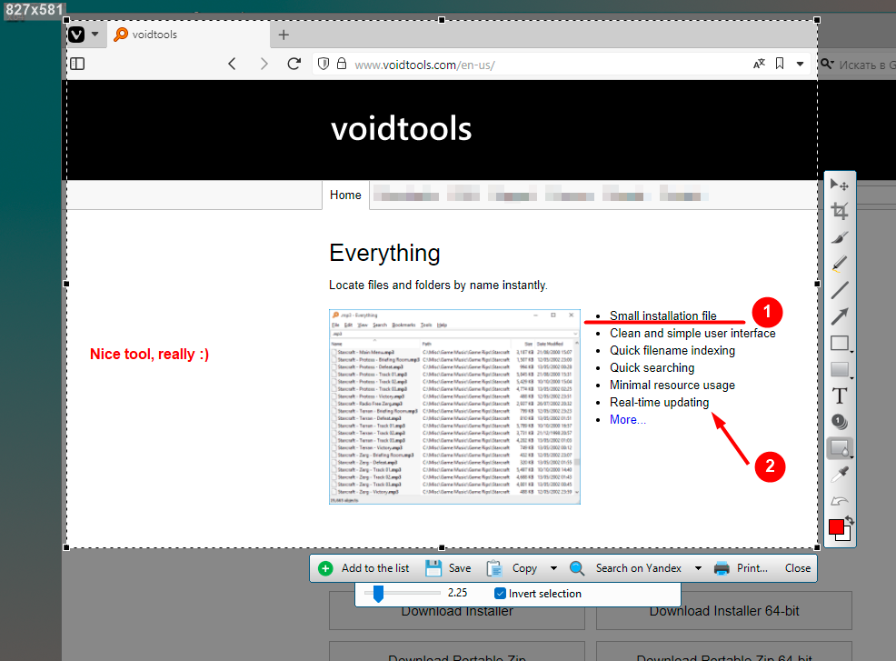

[](https://github.com/zenden2k/uptooda/actions/workflows/main.yml) 
[](https://hosted.weblate.org/engage/image-uploader/)

# Uptooda (formerly Image Uploader)

Uptooda is a free program for Windows for uploading images, screenshots and other file formats to over 30 different file hosting services. 
Official website: https://uptooda.com


[](https://svistunov.dev/uptooda_downloads)

Also available via WinGet:

```
winget install Uptooda
```
Supported operating systems: Windows 7/8/8.1/10/11 or newer

[Version 1.3.2](https://github.com/zenden2k/uptooda/releases/tag/1.3.2-release) was the last supported release for Windows XP and Windows Vista.

## Main Features

### Uploading files to image hostings and file hostings
The program can upload images and files to [several dozen hosting services](https://svistunov.dev/uptooda_servers). Also Uptooda can upload files to your own FTP/SFTP/WebDAV server. After uploading, Uptooda will generate HTML code, BBCode and Markdown code for forums. It is also possible to specify your own output template.

### Screen capturing and annotating
The program can capture screenshots of the entire screen, the active window, or a mouse-selected screen area (rectangular area, selected window, or freeform area).



### Screen Recording
Uptooda provides screen video recording functionality for creating demonstration content, offering two technological approaches. The first method works based on DirectX and Desktop Duplication API without additional software, using H.264 and AAC codecs with the ability to simultaneously record audio from multiple sources (requires Windows 8+). The alternative method uses FFmpeg version 7+ for more flexible settings and a greater number of formats, but requires prior installation of the utility and virtual audio devices for recording system sound, also supporting Desktop Duplication API technology for efficient screen capture.


### Grabbing frames from a video clip
The program is capable of extracting a specified number of frames from video files in most of popular formats. Uptooda can use both the codecs installed on your system and the codecs distributed with the program.

The extracted frames can be individually uploaded to the selected hosting service or combined into a single mosaic image.

Uptooda is available in multiple languages: English, Russian, French, Swedish, Romanian, Ukrainian, Turkish, Serbian, Hrvatski, Farsi, Arabic, Korean.

## Console utility (uptooda-cli)

The console utility is available on Windows and Linux.


See more:

https://svistunov.dev/uptooda-cli

## Documentation

[User Guide (Russian)](https://zenden2k.github.io/uptooda/)

[Scripting API](https://zenden2k.github.io/uptooda/api/html/index.html)

## Building from source

See [COMPILING.MD](COMPILING.MD)

# Contribution

## Internationalization

Help learning Uptooda speak multiple languages. The project's i18n is based on the GNU Gettext localization model. We use [Weblate](https://hosted.weblate.org/projects/image-uploader/) for translations. 


